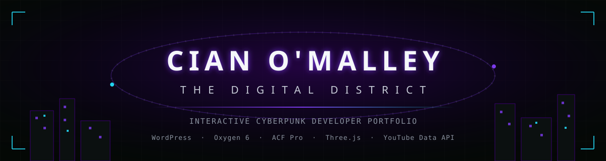
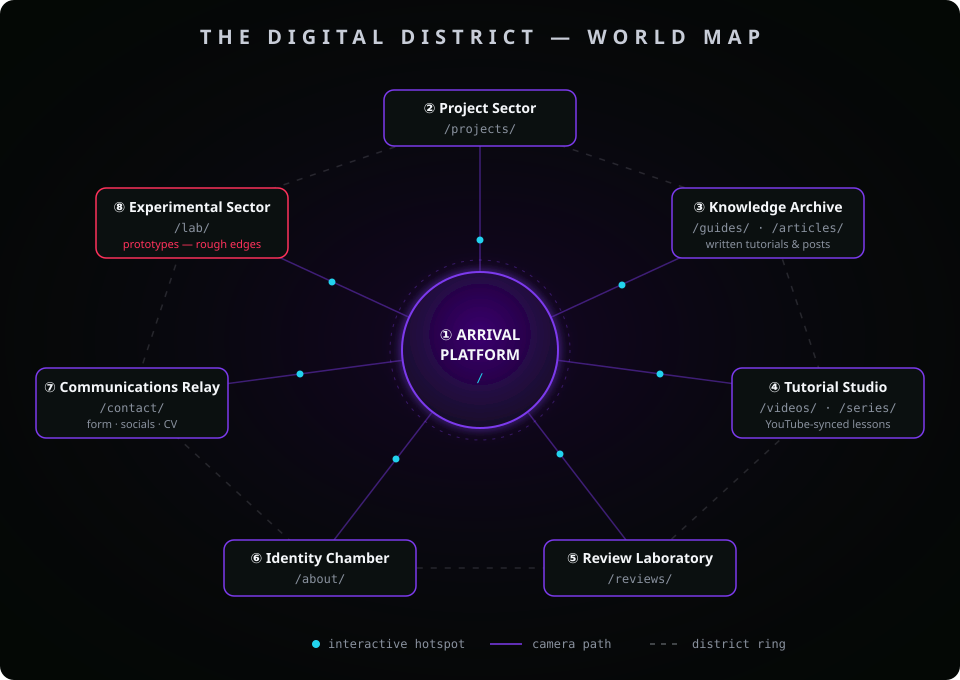
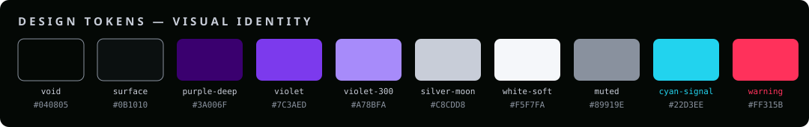
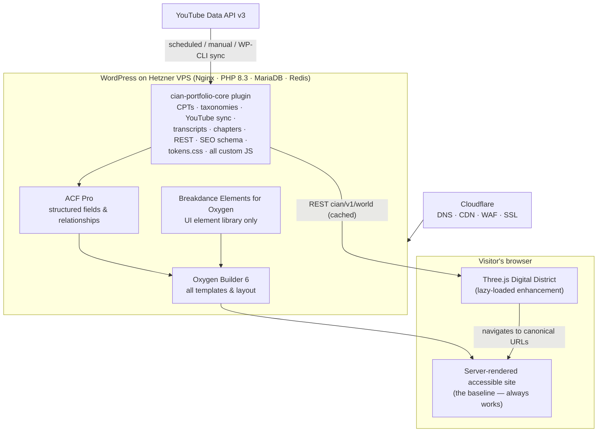
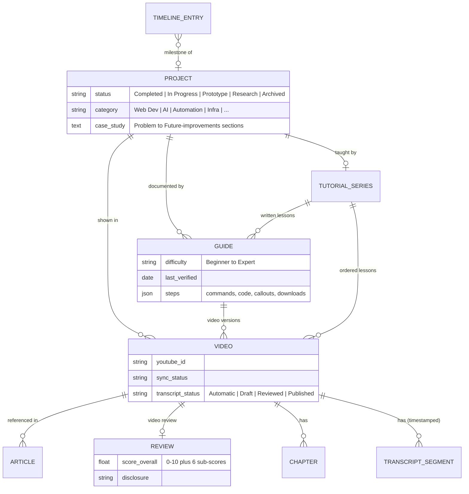
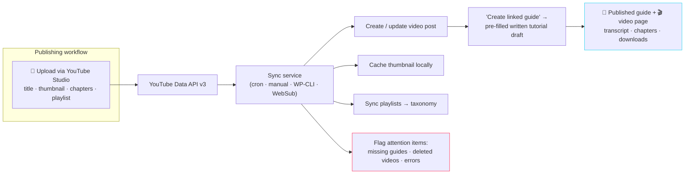
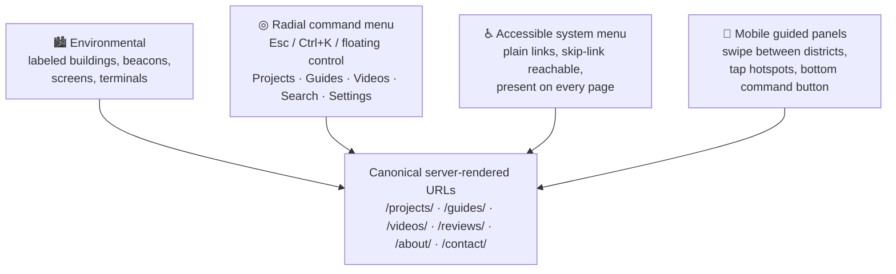
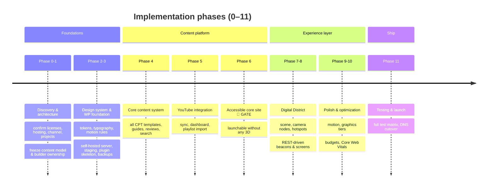

<div align="center">



**An interactive cyberpunk developer portfolio — a cinematic Three.js "Digital District" built as a progressive enhancement on top of a fully accessible WordPress content platform.**

[](docs/plan/README.md)
[](docs/plan/02-builder-architecture.md)
[](docs/plan/08-builder-implementation-plans.md)
[](docs/plan/07-animation-and-3d.md)
[](docs/plan/04-youtube-and-video-system.md)
[](docs/plan/10-accessibility-responsive-performance.md)

**Primary portfolio** `cianomalley.works` &nbsp;·&nbsp; **Showcase projects & demos** `cianomalley.dev`

</div>

---

## Table of contents

- [What is being built](#what-is-being-built)
- [The Digital District](#the-digital-district)
- [Visual identity](#visual-identity)
- [System architecture](#system-architecture)
- [Content platform](#content-platform)
- [YouTube synchronization pipeline](#youtube-synchronization-pipeline)
- [Navigation & experience layers](#navigation--experience-layers)
- [Build roadmap](#build-roadmap)
- [Guiding principles](#guiding-principles)
- [Repository structure](#repository-structure)
- [The master plan](#the-master-plan)
- [The plugin](#the-plugin)
- [Working in this repo](#working-in-this-repo)

---

## What is being built

This repository contains the master plan and the site-specific WordPress plugin for **Cian O'Malley's portfolio and technical-content platform** — one site that serves two jobs at once:

**1. A portfolio that proves the work.**
Project case studies (AI Operating System, Self-Hosted Knowledge Hub, this portfolio itself, Tactical Streaming Interface, Home Server Platform, AI Research Workspace) presented so that a recruiter understands *who Cian is, what he builds, which technologies he uses, where the strongest projects are, and how to contact him* — within 30 seconds of arriving.

**2. A publishing platform that teaches.**
Written technical guides, step-by-step tutorials, software & equipment reviews, and videos — with YouTube as the delivery platform and WordPress as the system of record. Every important tutorial video gets a written summary, searchable transcript, chapters, downloads, and its own page: knowledge never lives *only* on YouTube.

Wrapped around both is the experience layer: **The Digital District**, a compact cinematic cyberpunk environment rendered in a single lazy-loaded Three.js scene. It is a strict *progressive enhancement* — the complete, accessible, server-rendered site is built first and works without WebGL, a mouse, animation, sound, or YouTube.

| Pillar | What it means in practice |
|---|---|
| 🏙️ **Interactive world** | 8 labeled destinations, fixed camera nodes, DOM hotspots — no WASD, no getting lost, deep-linkable URLs everywhere |
| 📝 **Guides & articles** | Step-by-step template with copyable commands, code blocks, callouts, troubleshooting, verification checklists, last-verified dates |
| 🎬 **Video system** | YouTube Data API sync (title, thumbnail, duration, playlists), click-to-load privacy embeds, transcripts with timestamps, chapters |
| ⭐ **Reviews** | Scored software/equipment reviews with pros/cons, specs, disclosure, and linked video reviews |
| 🎓 **Tutorial series** | Ordered curricula linking videos + written lessons, mirrored to YouTube playlists, resumable per device |
| ♿ **Accessibility** | WCAG 2.2 AA target; the non-3D fallback site is the baseline, not an afterthought |
| 🔒 **Privacy (GDPR)** | `youtube-nocookie` click-to-load facades, zero Google requests before consent, cookieless analytics, German Impressum |

---

## The Digital District

A compact orbital-industrial campus at night — dark glass, deep purple light, silver structural lines, slow data traffic. Eight clearly labeled destinations arranged around a central hub, each mapping 1:1 to real WordPress content:

<div align="center">



</div>

| District | Concept | Content behind it |
|---|---|---|
| ① **Arrival Platform** | central hub, identity & orientation | homepage `/` |
| ② **Project Sector** | server towers with glowing project beacons | `/projects/` case studies |
| ③ **Knowledge Archive** | virtual documentation shelves | `/guides/` · `/articles/` |
| ④ **Tutorial Studio** | floating screens, holographic edit timeline | `/videos/` · `/series/` |
| ⑤ **Review Laboratory** | instrument benches, holographic exhibits | `/reviews/` |
| ⑥ **Identity Chamber** | quiet chamber with an ascending timeline | `/about/` |
| ⑦ **Communications Relay** | signal tower with rotating scan | `/contact/` |
| ⑧ **Experimental Sector** | half-built structures, warning lights | `/lab/` prototypes |

The visitor can **always** return to the hub, go back, open the map, open global search, reset the camera, enable simplified mode, disable animation, and change graphics quality (Automatic / Low / Balanced / High).

---

## Visual identity

Purple, silver, black, and muted white form the identity. Cyan appears **only** as an interactive/system indicator; red **only** as a warning. Tokens live in a builder-independent `tokens.css`:

<div align="center">



</div>

**Type:** Space Grotesk (display) · Inter (body) · JetBrains Mono (code & terminal UI) — all self-hosted woff2, no font CDNs.

---

## System architecture

One builder owns production; one plugin owns everything a builder shouldn't touch:



Key rule: **Breakdance never owns templates** — it exists only as an element pack inside Oxygen. All API logic, credentials, and business logic live in the plugin, never in builder code blocks. Swap the builder and only the layout layer needs rebuilding.

---

## Content platform

Seven custom post types, connected through bidirectional relationships (backed by a dedicated lookup table for fast reverse queries):



Every content type carries SEO fields and emits structured data (`HowTo`, `VideoObject`, `TechArticle`, `Review`, `Product`, `SoftwareApplication`, …) from a single-emitter pipeline — no duplicate schema.

---

## YouTube synchronization pipeline

YouTube hosts the public videos; WordPress caches everything it needs to render — the site keeps working even when the API is down:



An admin dashboard shows the connected channel, last sync, quota estimate, and an attention queue (videos without written guides, broken links, private/deleted videos). Credentials live in `wp-config.php` — never in the database or builder elements.

---

## Navigation & experience layers

Four coordinated layers all reach the same canonical URLs — there is no content that only exists inside the 3D world:



---

## Build roadmap

The accessible core site is a **hard gate**: it must be launch-ready *before* any 3D work begins.



---

## Guiding principles

Priority order for every trade-off: **professional clarity → easy navigation → strong projects → quality guides → reliable video → accessible transcripts → maintainable WordPress → mobile → performance → atmosphere → interaction → spectacle.**

| ✅ Always | 🚫 Never |
|---|---|
| Server-rendered content at direct URLs | Content that exists only in WebGL |
| Click-to-load `youtube-nocookie` embeds | Autoplay audio or eager YouTube players |
| Fixed camera nodes + labeled hotspots | WASD / free-roam gaming controls |
| One builder owning production templates | Two builders editing the same template |
| Written guide + transcript for key videos | Tutorial knowledge living only on YouTube |
| Subtle purple/silver atmosphere | Neon overload, rainbow gradients, glitch spam |

---

## Repository structure

```text
cianomalley-portfolio/
├── docs/
│   ├── assets/               ← README artwork (banner, district map, palette)
│   ├── plan/                 ← 📘 the 44-section master plan (14 parts + index)
│   └── discovery.md          ← Phase 0 confirmed decisions (input contract)
├── cian-portfolio-core/      ← 🔌 site-specific WordPress plugin
│   ├── cian-portfolio-core.php   ← bootstrap + module registry
│   ├── includes/             ← post-types, taxonomies, relationships, YouTube,
│   │                            transcripts, chapters, REST, SEO, security, privacy
│   ├── assets/css/           ← tokens, base, components, content, video, a11y
│   ├── assets/js/src/        ← loader, world, menu, player, chapters, transcripts
│   ├── acf-json/             ← version-controlled ACF field groups
│   └── cli/                  ← wp cian youtube <subcommand>
├── dev/                      ← 🐳 local Docker WordPress env + smoke test
├── .claude/                  ← project agents, skills, settings (Claude Code)
└── CLAUDE.md                 ← project brief for Claude Code sessions
```

---

## The master plan

The complete 44-section design, technical, content, and implementation plan lives in [`docs/plan/`](docs/plan/README.md):

| Part | Covers |
|---|---|
| [01](docs/plan/01-executive-summary-and-concept.md) | Executive summary · creative concept |
| [02](docs/plan/02-builder-architecture.md) | Builder architecture · Oxygen vs Breakdance · responsibility matrix |
| [03](docs/plan/03-information-architecture-and-content-model.md) | Information architecture · content model · ACF fields |
| [04](docs/plan/04-youtube-and-video-system.md) | YouTube integration · upload & sync workflows · video↔guide model |
| [05](docs/plan/05-world-and-navigation.md) | World map · user journeys · navigation · district specs |
| [06](docs/plan/06-design-system-and-components.md) | Design system · component inventories |
| [07](docs/plan/07-animation-and-3d.md) | Animation system · 3D strategy |
| [08](docs/plan/08-builder-implementation-plans.md) | Oxygen & Breakdance implementation plans |
| [09](docs/plan/09-plugin-and-api-architecture.md) | Custom plugin · API/data flows · search |
| [10](docs/plan/10-accessibility-responsive-performance.md) | Accessibility · responsive · performance budgets |
| [11](docs/plan/11-seo-privacy-admin.md) | SEO & schema · GDPR · admin workflow |
| [12](docs/plan/12-security-maintenance-hosting.md) | Security & maintenance · hosting |
| [13](docs/plan/13-roadmap-and-testing.md) | Phased roadmap · testing matrix |
| [14](docs/plan/14-risks-plugins-assets-docs-launch-future.md) | Risks · plugins · assets · docs · launch · future |

---

## The plugin

[`cian-portfolio-core/`](cian-portfolio-core/README.md) is the site-specific WordPress plugin that owns everything a page builder should not: post types, taxonomies, ACF registration, cross-content relationships, YouTube synchronization, transcripts, chapters, the REST API that feeds the 3D world, structured data, security, privacy/consent, the builder-independent design tokens, and all custom JS/CSS.

**Status:** Phase 3 scaffold — the content model registers and activates; YouTube sync, transcript editing, and the Three.js scene are stubbed with documented contracts and land in Phases 4–7. Requires WordPress ≥ 6.5, PHP ≥ 8.1, and ACF Pro. Credentials (`CIAN_YT_*`) live only in `wp-config.php`.

## Working in this repo

This repo holds planning docs and the plugin source; production WordPress lives on the server. For local work there's a throwaway Docker WordPress environment and a WordPress-free smoke test — see [`dev/`](dev/README.md):

```bash
# Full local WordPress + MariaDB + Redis, plugin bind-mounted, then verify
docker compose -f dev/docker-compose.yml up -d && ./dev/setup.sh

# No Docker needed — boots the plugin with WP stubs and asserts the data model
php dev/smoke-test.php

# Static checks
find cian-portfolio-core -name '*.php' -print0 | xargs -0 -n1 php -l
for f in cian-portfolio-core/assets/js/src/*.js; do node --check "$f"; done
```

Claude Code sessions have project agents (`wp-plugin-reviewer`, `docs-writer`) and skills (`/plugin-check`, `/caveman`) configured under `.claude/`; see [`CLAUDE.md`](CLAUDE.md).

---

<div align="center">

**Portfolio at `cianomalley.works`** · showcase projects at `cianomalley.dev` · planned in [`docs/plan/`](docs/plan/README.md)

</div>
