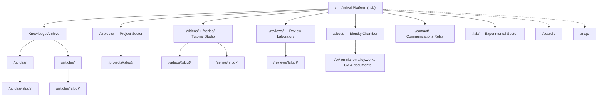
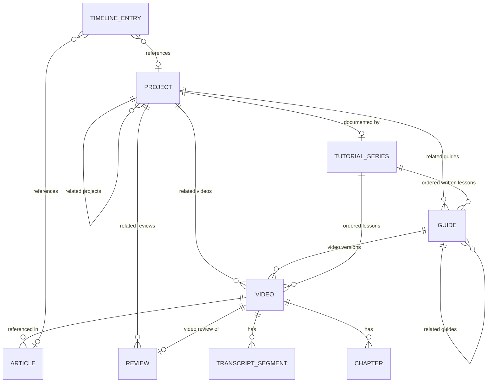

# Part 03 — Information Architecture, WordPress Content Model & ACF Fields

> Covers required output sections: **6. Information architecture**, **7. WordPress content model**, **8. ACF field structure**
> Plan index: [README.md](README.md)

---

## Section 6 — Information Architecture

### URL structure

| Content | URL pattern | Notes |
|---|---|---|
| Home / District hub | `/` | 3D mount + full HTML fallback |
| Projects archive | `/projects/` | filterable |
| Single project | `/projects/{slug}/` | case study |
| Guides archive | `/guides/` | filterable |
| Single guide | `/guides/{slug}/` | reading mode |
| Articles archive | `/articles/` | blog |
| Single article | `/articles/{slug}/` | |
| Videos archive | `/videos/` | static thumbnails |
| Single video | `/videos/{slug}/` | player + transcript |
| Series archive | `/series/` | tutorial series |
| Single series | `/series/{slug}/` | ordered lessons |
| Reviews archive | `/reviews/` | |
| Single review | `/reviews/{slug}/` | |
| About | `/about/` | + timeline |
| Contact | `/contact/` | |
| Lab / experiments | `/lab/` | curated page of Prototype/Research projects |
| Search | `/search/?q=` | global overlay posts here for no-JS |
| Sitemap page | `/map/` | human site map (mirrors 3D map) |
| Accessibility statement | `/accessibility/` | |
| Privacy policy | `/privacy/` | German/EU-compliant |
| Imprint | `/imprint/` | Impressum — likely legally required in Germany |
| CV / documents | `/cv/` on the primary site (`cianomalley.works`) or `/about/#cv` | primary domain hosts the CV |

Taxonomy archives: `/projects/category/{term}/`, `/guides/topic/{term}/`, `/guides/difficulty/{term}/`, `/videos/category/{term}/`, `/reviews/category/{term}/`, `/tag/{term}/` (shared technology tag). All content is server-rendered at direct URLs; the 3D layer only *navigates to* these URLs.

### Site architecture diagram

### Content relationship overview

---

## Section 7 — WordPress Content Model

All CPTs and taxonomies are registered in `cian-portfolio-core` (PHP), never in a builder. All are `public`, `show_in_rest => true` (needed for `cian/v1` composition and future editors), with `has_archive` and rewrite slugs per the URL table.

### Custom post types

| CPT | Slug | Supports | Archive | Notes |
|---|---|---|---|---|
| `project` | `projects` | title, editor, excerpt, thumbnail, revisions | yes | case studies |
| `guide` | `guides` | title, editor, excerpt, thumbnail, revisions | yes | step content in ACF flexible content |
| `article` | `articles` | title, editor, excerpt, thumbnail, revisions, author | yes | closest to native posts; native `post` type is unused/hidden |
| `review` | `reviews` | title, editor, excerpt, thumbnail, revisions | yes | |
| `video` | `videos` | title, editor (description), thumbnail, revisions | yes | thumbnail = cached YT thumb or manual |
| `tutorial_series` | `series` | title, editor, excerpt, thumbnail | yes | |
| `timeline_entry` | — (no single view) | title, editor | no | `publicly_queryable => false`; rendered on `/about/` |

### Custom taxonomies

| Taxonomy | Attached to | Terms (initial) | Hierarchical |
|---|---|---|---|
| `project_category` | project | Web Development, Artificial Intelligence, Automation, Infrastructure, Self-Hosting, Research, Streaming, Hardware, Experimental | yes |
| `project_status` | project | Completed, In Progress, Prototype, Research, Archived | no (flat, single-select via ACF UI) |
| `guide_category` | guide | Installation, Configuration, Development, WordPress, AI, Automation, Self-Hosting, Servers, Windows, Linux, macOS, Hardware, Streaming, Troubleshooting | yes |
| `difficulty` | guide, video, tutorial_series | Beginner, Intermediate, Advanced, Expert | no |
| `operating_system` | guide, video | Windows, Linux, macOS, Cross-platform | no |
| `video_category` | video | Tutorial, Project Log, Review, Livestream Archive, Short | yes |
| `review_category` | review | Software, Hardware, Peripherals, Audio, Streaming Gear, Services | yes |
| `article_category` | article | editorial choice | yes |
| `technology` | project, guide, article, video, review | e.g. PHP, WordPress, Three.js, Python, Docker… (grows organically) | no |
| `skill` | project | e.g. Systems Design, Frontend, DevOps… | no |
| `playlist` | video | mirrors YouTube playlists; term meta stores `yt_playlist_id` | no |

Design decisions: **difficulty, OS, technology, playlist are taxonomies** (they need archives/filter queries), while single-value descriptive data stays in ACF. `project_status` is a taxonomy so archives can filter by it, but the edit UI exposes it as a single-select ACF taxonomy field to keep entry simple. The `playlist` taxonomy is written by the YouTube sync and may also be curated manually.

### Relationships

All cross-content links use **ACF Relationship / Post Object fields** stored as post-ID arrays, registered with a bidirectional sync (plugin `relationships.php` mirrors A→B into B's reverse field on save — using ACF's bidirectional setting where sufficient, custom `acf/update_value` hooks where not). A composite MySQL index supports reverse lookups (Part 10 §31: relationship meta queried via `postmeta` with an added index, or a small custom lookup table `wp_cian_relationships (from_id, to_id, rel_type)` maintained on save — the custom table is the recommended approach for the world's REST queries and "related content" blocks).

---

## Section 8 — ACF Field Structure

Conventions: field names are `snake_case` prefixed per CPT (`project_`, `guide_`…); field groups are registered from JSON (`acf-json/` synced into the plugin) so they're version-controlled; every group uses **tabs**; every field has a label + instruction line; required fields marked ✱. SEO title/description fields exist on every CPT under a shared "SEO" tab (cloned field group `group_seo`) and feed the SEO plugin via filter.

### Group: Project (`group_project`, on `project`)

| Tab | Field | Type | Notes |
|---|---|---|---|
| Overview | `project_short_title` | text | for beacon labels / cards |
| | `project_summary` ✱ | textarea | ≤ 280 chars, used in cards + hub panels |
| | `project_year` | number | |
| | `project_start_date` / `project_completion_date` | date picker | completion blank while in progress |
| | `project_featured` | true/false | drives homepage/beacon priority |
| | `project_role` | text | |
| | `project_collaborators` | repeater (name, url) | |
| | `project_accent_color` | select (token names, not free color) | maps to CSS token; keeps palette controlled |
| Taxonomy-backed | status, category, technologies, skills | taxonomy fields | single-select for status |
| Case study | `project_problem`, `project_goals`, `project_constraints`, `project_research`, `project_architecture`, `project_implementation`, `project_challenges`, `project_results`, `project_lessons_learned`, `project_future_improvements` | wysiwyg (each) | rendered as case-study sections; empty sections skipped |
| Media | `project_cover_image` ✱ | image | |
| | `project_screenshots` | gallery | |
| | `project_video_gallery` | relationship → `video` | multiple |
| Links | `project_github_url`, `project_live_url`, `project_docs_url` | url | |
| Related | `project_related_guides` | relationship → guide | bidirectional |
| | `project_related_videos` | relationship → video | bidirectional |
| | `project_related_reviews` | relationship → review | bidirectional |
| | `project_related_projects` | relationship → project | bidirectional |
| | `project_tutorial_series` | post object → tutorial_series | |
| World | `project_object_id` | text (slug-like) | interactive object identifier in the 3D scene |
| | `project_environment_section` | select (district ids) | which district hosts its beacon |
| SEO | clone `group_seo` | | |

### Group: Guide (`group_guide`, on `guide`)

| Tab | Field | Type | Notes |
|---|---|---|---|
| Overview | `guide_summary` ✱ | textarea | |
| | `guide_introduction` | wysiwyg | |
| | `guide_estimated_time` | text (e.g. "45 min") | |
| | `guide_required_knowledge` | wysiwyg | |
| | `guide_featured` | true/false | |
| | `guide_last_verified` ✱ | date | surfaced prominently on template |
| | `guide_software_versions` | repeater (software, version) | |
| Taxonomy | difficulty, guide_category, operating_system, technology | taxonomy fields | |
| Requirements | `guide_prerequisites` | repeater (text, optional link) | |
| | `guide_required_software` | repeater (name, url, version) | |
| | `guide_required_hardware` | repeater (name, notes) | |
| Steps | `guide_steps` ✱ | **flexible content** | layouts: `step_section` (title, wysiwyg body, screenshots gallery, diagram image), `command_block` (language select, code textarea, description), `code_block` (language, code, filename), `info_callout` (wysiwyg), `warning_callout` (wysiwyg), `download` (file, label) |
| Wrap-up | `guide_troubleshooting` | repeater (problem, solution wysiwyg) | |
| | `guide_common_errors` | repeater (error message text, cause, fix) | error text is search-indexed |
| | `guide_verification_steps` | repeater (check text) | rendered as checklist |
| | `guide_conclusion` | wysiwyg | |
| | `guide_downloads` | repeater (file, label, description) | |
| | `guide_sources` | repeater (label, url) | |
| Related | `guide_related_project` | post object → project | bidirectional |
| | `guide_related_videos` | relationship → video | bidirectional (a guide can have multiple videos) |
| | `guide_related_playlist` | taxonomy → playlist | |
| | `guide_related_guides` | relationship → guide | |
| | `guide_previous` / `guide_next` | post object → guide | manual series ordering fallback |
| SEO | clone `group_seo` | | |

### Group: Article (`group_article`, on `article`)

Excerpt/content/featured image/date/updated use native WP. ACF adds: `article_reading_time` (number, auto-filled by plugin on save, editable), `article_featured` (true/false), `article_show_toc` (true/false; TOC auto-generated from H2/H3 by plugin), related relationships (`article_related_projects`, `article_related_guides`, `article_related_videos`, `article_related_reviews` — all bidirectional), `article_sources` (repeater), SEO clone. Tags via `technology` + `article_category`.

### Group: Review (`group_review`, on `review`)

| Tab | Field | Type |
|---|---|---|
| Product | `review_product_name` ✱ (text), `review_manufacturer` (text), `review_product_image` ✱ (image), `review_gallery` (gallery), `review_price_at_review` (text + currency select), `review_date` ✱ (date), `review_disclosure` ✱ (select: Purchased / Review sample / Sponsored / Affiliate links) |
| Scores | `review_score_overall` ✱, `review_score_design`, `review_score_features`, `review_score_performance`, `review_score_ease`, `review_score_compatibility`, `review_score_value` — all number 0–10 step 0.5 |
| Verdict | `review_summary` ✱ (textarea), `review_pros` (repeater: text), `review_cons` (repeater: text), `review_best_for` (repeater: text), `review_not_for` (repeater: text), `review_recommended` (true/false), `review_editors_choice` (true/false), `review_final_verdict` (wysiwyg) |
| Detail | `review_specifications` (repeater: spec, value), `review_setup`, `review_usability`, `review_build_quality`, `review_features_detail`, `review_performance_detail`, `review_compatibility_detail`, `review_long_term_value` (wysiwyg each), `review_alternatives` (repeater: name, url, note) |
| Video | `review_video` (post object → video, bidirectional), `review_youtube_id` (text, read-only mirror filled from linked video) |
| Related | `review_related_guides`, `review_related_videos`, `review_related_reviews` (relationships, bidirectional) |
| SEO | clone `group_seo` |

### Group: Video (`group_video`, on `video`)

| Tab | Field | Type | Notes |
|---|---|---|---|
| Source | `video_source` ✱ | select: YouTube / Local upload / External URL / Self-hosted stream / Unlisted YouTube | conditional logic drives the rest of the tab |
| | `video_youtube_id` | text | shown when source is YouTube/Unlisted; unique-validated |
| | `video_youtube_url` | url | auto-derived, editable |
| | `video_local_file` | file (mp4/webm) | shown for Local; upload cap enforced |
| | `video_external_url` | url | |
| | `video_duration` | text `HH:MM:SS` | synced for YT |
| | `video_upload_date` / `video_publication_date` | date | synced for YT |
| | `video_channel_name` | text | synced |
| Sync (read-only UI) | `video_sync_status` | select: Never / Synced / Error / Deleted-on-YouTube / Private | written by sync service |
| | `video_last_synced` | datetime | written by sync service |
| Content | description via native editor; `video_featured` (true/false) | | |
| Chapters | `video_chapters` | repeater: `chapter_title` ✱, `chapter_start` ✱ (`HH:MM:SS`), `chapter_end` (auto = next start), `chapter_description` (textarea), `chapter_guide_section` (text anchor into related guide) | |
| Transcript | `video_transcript_status` | select: None / Automatic / Draft / Reviewed / Published | |
| | transcript body | stored by plugin (custom table, Part 09), edited via admin metabox with timestamped segments; VTT/SRT/plain-text import | not a raw ACF textarea — too large |
| | `video_captions_file` | file (VTT) | served with local player; linked for YT reference |
| Resources | `video_commands` | repeater (language, code, note) | "commands used in the video" |
| | `video_downloads` | repeater (file, label) | |
| | `video_source_files` | repeater (file/url, label) | |
| | `video_github_url` | url | |
| | `video_equipment` | relationship → review (equipment) + repeater fallback (name, url) | |
| | `video_software` | repeater (name, url, version) | |
| | `video_corrections` | repeater (timestamp, correction wysiwyg) | "corrections & updates" |
| Related | `video_related_guide` | post object → guide (primary written version, bidirectional) | one-to-one primary |
| | `video_related_articles` | relationship → article | one-to-many |
| | `video_related_project` | post object → project | |
| | `video_related_review` | post object → review | |
| | playlist | taxonomy field | synced from YT |
| SEO | clone `group_seo` | | |

### Group: Tutorial Series (`group_series`, on `tutorial_series`)

`series_summary` ✱ (textarea), difficulty (taxonomy), `series_target_audience` (textarea), `series_required_tools` (repeater), cover via featured image, `series_playlist_url` (url), `series_youtube_playlist_id` (text — links sync), `series_lessons` ✱ (**repeater**, each row: `lesson_video` post object → video, `lesson_guide` post object → guide, `lesson_label` text — the row order IS the lesson order; at least one of video/guide required per row), `series_related_project` (post object), `series_completion_status` (select: Planned / In production / Ongoing / Complete), `series_total_duration` (text, auto-computed from lesson videos, editable), `series_lesson_count` (number, auto), `series_prerequisites` (repeater), `series_learning_outcomes` (repeater), SEO clone.

### Group: Timeline Entry (`group_timeline`, on `timeline_entry`)

`timeline_type` ✱ (select: Project / Milestone / Learning / Release / Publication), `timeline_date` ✱ (date) + `timeline_date_end` (optional range), description via editor, `timeline_related_project` (post object), `timeline_related_article` (post object), `timeline_icon` (select from icon set), `timeline_order` (number, tiebreaker). **No employer/qualification types are pre-seeded — nothing is invented.**

### Group: Site Options (ACF Options Page "Portfolio Settings", plugin-registered)

Social links repeater (platform, url, show-in-relay true/false), CV file (file field — "Replace CV" is one upload), YouTube channel URL + subscribe link, contact email display, default OG image, consent texts, world feature flag (3D on/off), graphics default, footer/legal links. **No API credentials here** — those live in `wp-config.php` constants only (Part 04).
