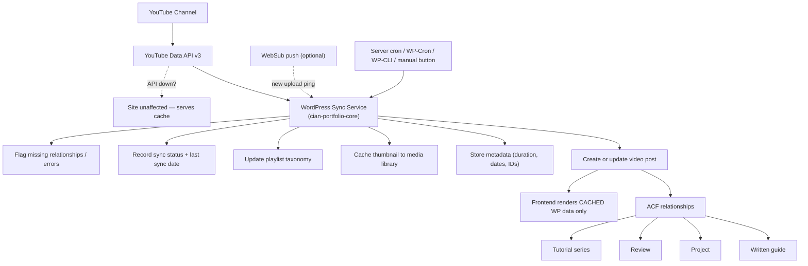
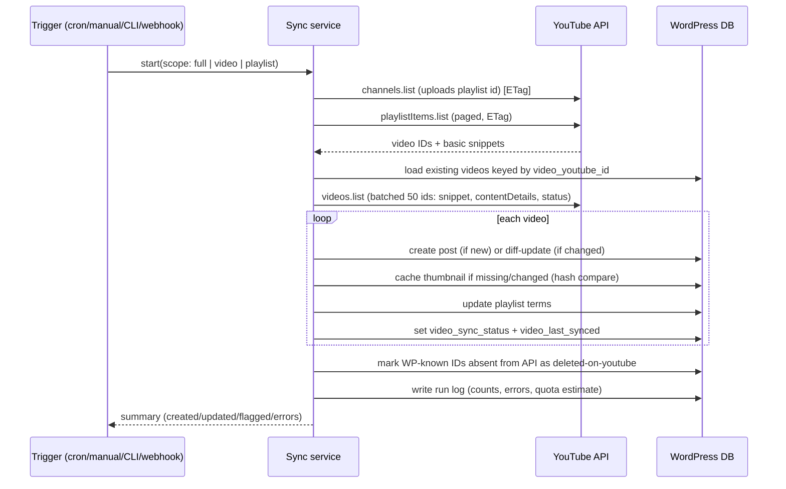
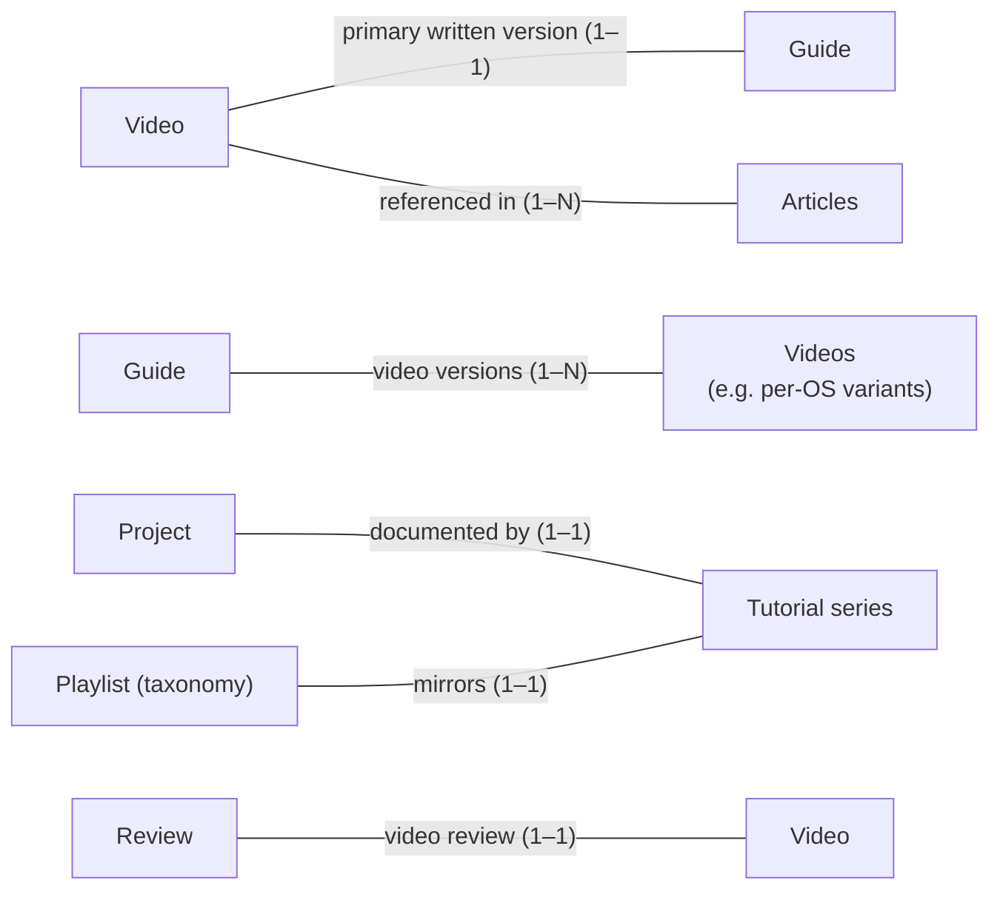

# Part 04 — YouTube Integration, Upload & Sync Workflows, Video↔Guide Relationships, Tutorial-Series Model

> Covers required output sections: **9. YouTube integration architecture**, **10. Video-upload workflow**, **11. Video synchronization workflow**, **12. Video and guide relationship model**, **13. Tutorial-series model**
> Plan index: [README.md](README.md)

---

## Section 9 — YouTube Integration Architecture

### Principles

1. **YouTube is the delivery platform; WordPress is the system of record for presentation.** Every public tutorial video gets a WP `video` post with cached metadata. The frontend renders **only cached WP data** — the site works identically when the YouTube API is down.
2. **Read-mostly integration.** Reading channel/playlist/video metadata needs only an **API key** (no OAuth) for public data. OAuth is required only for private/unlisted video metadata and the optional upload feature (Section 10, Workflow B).
3. **Credentials never touch builders.** Stored as constants in `wp-config.php` (`CIAN_YT_API_KEY`, `CIAN_YT_OAUTH_CLIENT_ID`, `CIAN_YT_OAUTH_CLIENT_SECRET`) or real environment variables read via `getenv()`. OAuth refresh tokens are stored encrypted (libsodium `sodium_crypto_secretbox`, key in `wp-config.php`) in a non-autoloaded option. The plugin settings page shows *status only* (connected/not, key present/absent) — never the secrets.

### Components (all in `cian-portfolio-core`)

| Module | Responsibility |
|---|---|
| `youtube-api.php` | thin API client: `videos.list`, `playlists.list`, `playlistItems.list`, `channels.list`, `captions.list`; ETag caching; quota bookkeeping; exponential backoff on 403/5xx |
| `youtube-oauth.php` | optional OAuth 2.0 flow (auth-code w/ offline access), token encryption/refresh/revocation |
| `youtube-sync.php` | sync orchestration: diffing API data vs WP posts, create/update/flag |
| `video-import.php` | initial channel/playlist import wizard logic |
| `scheduled-tasks.php` | WP-Cron schedules + real-cron detection warning |
| `cli/youtube-sync-command.php` | `wp cian youtube sync|import|status|verify` |
| `admin-pages.php` | sync dashboard (below) |

### Synchronized fields (API → WP `video` post)

Title → post title (only if not locally overridden — an `video_title_locked` flag protects manual edits); description → post content (same lock rule); thumbnail → downloaded to media library (`maxresdefault` with fallback chain) and set as featured image; publication date → `video_publication_date` + post date; duration (ISO-8601 → `HH:MM:SS`) → `video_duration`; tags → `technology` terms (mapped via allowlist, unmatched tags stored in meta for review, not auto-created); playlist membership → `playlist` taxonomy terms (term meta `yt_playlist_id`); privacy status → `video_privacy` meta (when OAuth grants access); live/premiere status → `video_live_status` meta; YouTube ID → `video_youtube_id` (unique key for diffing); deleted/unavailable detection → `video_sync_status = deleted-on-youtube` + admin flag (post is **not** auto-deleted); `video_last_synced` timestamp on every pass.

### Sync modes

- **Manual:** "Sync now" button (admin dashboard) → immediate run via Action Scheduler/async request.
- **Scheduled:** WP-Cron event `cian_youtube_sync` every 6 h (configurable). Documentation instructs disabling pseudo-cron (`DISABLE_WP_CRON`) and using a real server cron hitting `wp-cron.php` — dashboard warns if last run is stale.
- **Webhook (evaluated, optional):** YouTube supports **WebSub/PubSubHubbub** push for channel uploads. Cheap near-real-time *new video* detection; does not cover metadata edits or playlist changes, so polling remains necessary regardless. Verdict: **optional enhancement, Phase 5+** — subscribe to the channel topic, handle the callback endpoint (`/wp-json/cian/v1/yt-webhook`, verified via `hub.challenge` + HMAC secret), trigger a targeted single-video sync.
- **WP-CLI:** `wp cian youtube sync [--full] [--video=<id>] [--playlist=<id>] [--dry-run]` for server cron and debugging.

### Quota budget

Default quota 10,000 units/day; reads cost ~1 unit per call page. A full sync of a few hundred videos = well under 100 units. Uploads cost ~1,600 units each (Section 10). The client records daily unit estimates in an option and the dashboard shows usage; on quota exhaustion the sync aborts gracefully, flags the error, and retries next window.

### Admin sync dashboard (WP admin → "Portfolio → YouTube")

Shows: connected channel (name, avatar, subscriber-count snapshot); last sync time + result; imported-video count; **attention queue**: videos with missing thumbnails, videos without a related written guide, broken/deleted YouTube links, private/unavailable videos, sync errors (with raw API error stored); manual **Sync now** button; **playlist import** controls (list channel playlists → checkbox import → creates `playlist` terms + video posts); OAuth connect/disconnect (only if Workflow B enabled); quota estimate meter.

### Architecture diagram

---

## Section 10 — Video-Upload Workflow

### Workflow A — Upload through YouTube Studio (**recommended default**)

1. Record/edit video; upload via YouTube Studio.
2. In Studio: title, description, custom thumbnail, chapters (in description), tags, playlist, visibility, captions.
3. WordPress syncs (webhook ping or next scheduled run, or "Sync now") → `video` post created with cached metadata, thumbnail, playlist terms; chapters parsed from the description's `MM:SS Title` lines into the chapters repeater as a *draft* the owner confirms.
4. Owner creates/links the written guide: from the video edit screen, a "Create linked guide" button generates a `guide` draft pre-filled from the video (title, embed link, chapters as step-section stubs, transcript draft if available) — or links an existing guide via the relationship field.
5. Publish guide; bidirectional relationship set; attention queue clears.

**Why default:** zero quota cost for upload, YouTube's own resumable/transcode pipeline, no server load, no OAuth upload scope, no security surface. This is the lowest-risk path and matches ordinary creator workflow.

### Workflow B — Upload from WordPress to YouTube (**optional / deferred; disabled by default**)

Capabilities if enabled: select local file → title, description, privacy, playlist, tags, custom thumbnail → resumable upload to YouTube → create linked WP video post → prompt to link a guide.

Honest constraints (the reasons it is deferred):

- **OAuth:** requires `youtube.upload` scope, a Google Cloud project, OAuth consent screen; unverified apps face restrictions and periodic re-consent; refresh tokens can be revoked and must be monitored.
- **Quota:** `videos.insert` ≈ 1,600 units — 6 uploads exhausts a default day's quota; quota increases require Google review.
- **Upload size/timeouts:** tutorial videos are multi-GB. Ordinary WP hosting has PHP `upload_max_filesize`/`post_max_size`/`max_execution_time` limits and per-request timeouts wholly unsuited to this. Any implementation must use **chunked resumable uploads** (YouTube resumable protocol) driven by a **background queue** (Action Scheduler) from a file already on the server (e.g. uploaded via SFTP or a chunked uploader) — never a single PHP request proxying gigabytes.
- **Security:** an authenticated endpoint that accepts huge files and holds an upload-scope token is a meaningful attack surface; requires strict capability checks, nonce + rate limiting, file-type validation, and encrypted token storage.
- **When Studio is simply better:** almost always — Studio provides transcode progress, copyright checks, thumbnail A/B, end screens, and monetization settings that the API path lacks.

**Decision rule (per brief):** Workflow B is only built if hosting is a VPS with Action Scheduler + adequate disk and the owner demonstrably needs it (e.g. automated pipeline from a render server). Until then: **rejected for implementation, documented for the future** (Part 14 §44).

---

## Section 11 — Video Synchronization Workflow

### Sync algorithm (per run)

Details: diffing compares stored ETag/hash per video to skip no-op writes; locked fields (`*_locked` flags) are never overwritten; deleted-on-YouTube videos keep their WP page (transcript/guide value persists) with the player replaced by an "unavailable on YouTube" notice; duplicate prevention via unique `video_youtube_id` lookup **before** insert plus a unique index in the relationships table; temporary API failure → retry with backoff (3 attempts), then log and continue with remaining videos; quota failure → abort run, flag, schedule retry after quota reset.

### Failure modes covered (feeds Testing Matrix, Part 13)

initial connection, OAuth token expiry/renewal (if used), manual sync, scheduled sync, playlist import, new video, updated title, updated thumbnail, deleted video, private video, quota exhaustion, transient API failure, duplicate prevention.

---

## Section 12 — Video and Guide Relationship Model

### Cardinalities (all supported)

- **Video → Guide:** `video_related_guide` (post object, the *primary* written version) — bidirectionally mirrored into `guide_related_videos`.
- **Guide → Videos:** `guide_related_videos` relationship (many), covering per-OS or updated re-recordings.
- **Video → Articles:** `video_related_articles` relationship (many).
- **Project → Series:** `project_tutorial_series` / `series_related_project`.
- **Review ↔ Video:** `review_video` / `video_related_review`.
- **Playlist ↔ Series:** `series_youtube_playlist_id` matches the `playlist` term's `yt_playlist_id`; sync suggests the link when a playlist import matches an existing series.

### What appears where

**Guide page** embeds its primary video (click-to-load), renders the video's chapters as deep links into guide sections (`chapter_guide_section` anchor), shows commands/code/screenshots/downloads/troubleshooting/verification natively, and links previous/next lessons. **Video page** embeds the player, written summary, full transcript (lazy), chapter list, commands, downloads, related project/equipment/software, corrections, publication + last-reviewed dates, and a prominent "Read the written guide" panel when linked.

### Editing UX

Relationship management happens through ACF relationship fields with search + post-type filters, plus the sync dashboard's **attention queue** ("videos without guides") and the **"Create linked guide"** generator button (Section 10, step 4). No custom admin app is needed initially — ACF UI + the queue meets the "easy to manage" requirement at far lower maintenance cost. A custom matrix screen is a future option (Part 14 §44).

---

## Section 13 — Tutorial-Series Model

A `tutorial_series` is the canonical curriculum object; a YouTube playlist is its distribution mirror.

- **Ordering:** the `series_lessons` repeater is the single source of lesson order (each row: video and/or guide + optional label like "Lesson 3 — Networking"). Drag-to-reorder in ACF. Sync **suggests** new playlist videos as candidate rows (attention queue) but never reorders the repeater automatically.
- **Derived data:** `series_lesson_count` and `series_total_duration` recomputed on save from rows/video durations (editable overrides).
- **Series page renders:** cover, summary, difficulty, target audience, required tools, prerequisites, learning outcomes, completion status, total duration, and the ordered lesson list — each lesson row showing video thumbnail + duration, written-guide indicator, and per-lesson links ("Watch" / "Read").
- **Continue a series:** lesson position stored in `localStorage` (no account system, no server-side personal data); the series page and Tutorial Studio surface a "Continue at Lesson N" button. Progress is device-local and GDPR-trivial.
- **Navigation:** guide and video templates render "Part N of {series}" breadcrumbs with previous/next lesson controls derived from the repeater (falling back to `guide_previous`/`guide_next` for non-series guides).
- **Playlist links:** "Open playlist on YouTube" uses `series_playlist_url`; per-lesson YouTube links preserve playlist context (`&list=`).
