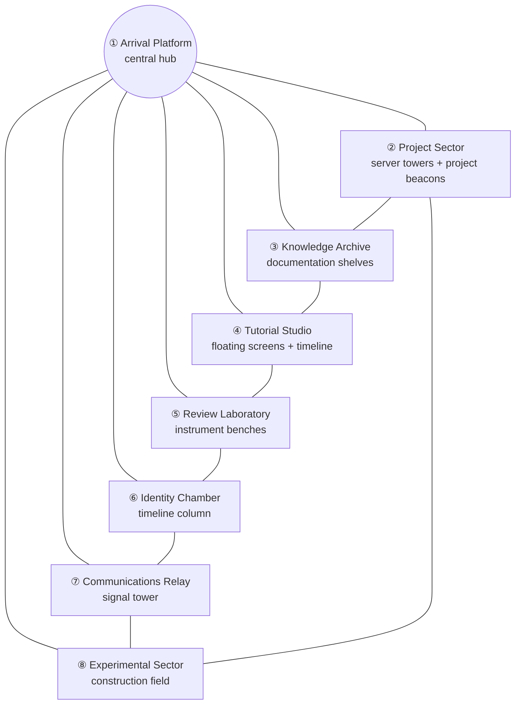
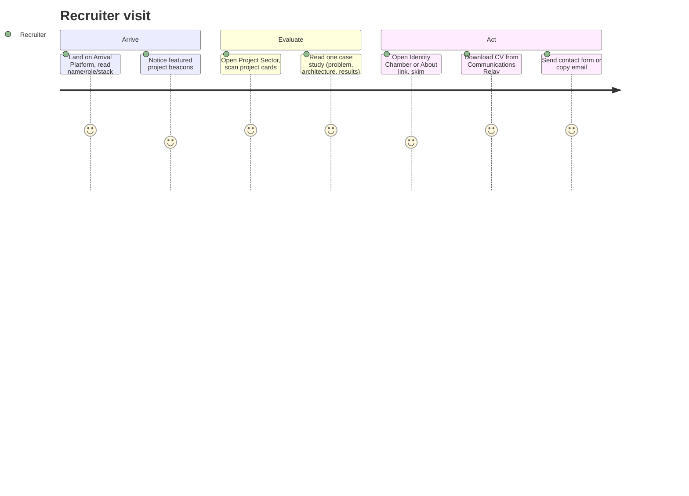
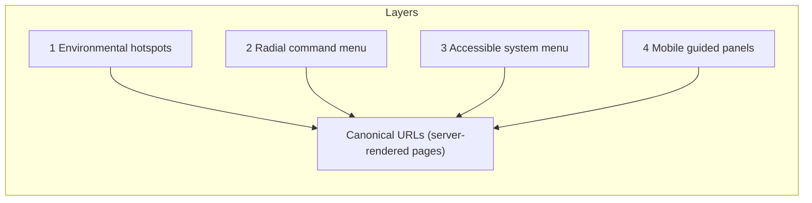

# Part 05 — World Map, User Journeys, Navigation Model, Page & District Specifications

> Covers required output sections: **14. World map**, **15. User journeys**, **16. Navigation model**, **17. Page and district specifications**
> Plan index: [README.md](README.md)

---

## Section 14 — World Map

The Digital District is a compact ring layout: the **Arrival Platform** at center, seven destinations arranged around it, each one camera-glide away. No destination is more than one hop from the hub; adjacent districts are also directly connected (ring path with illuminated data lines).

**Camera node graph:** one establishing node (hub overview), one node per district (framed medium shot), plus focus nodes per interactive object class (project beacon close-up, video wall close-up, etc.). All transitions are predefined eased paths between nodes — never free flight. The 2D **map overlay** (keyboard/touch accessible, also at `/map/`) mirrors this diagram with plain links.

---

## Section 15 — User Journeys

### Journey A — Recruiter (goal: assess in 2–3 minutes)

Design consequences: identity text is instant HTML; "CV" and "Contact" are reachable in ≤2 clicks from anywhere (command menu); case studies front-load Problem → Architecture → Results; simplified mode auto-suggested if WebGL is slow so a recruiter is never stuck watching a loader.

### Journey B — Learner from YouTube (goal: the written version + files)

Arrives deep-linked at `/videos/{slug}/` from a YouTube description → sees player (click-to-load, consent-safe), chapter list, "Read the written guide" panel → opens guide → 3D never loads (conditional assets); reading mode, copyable commands, downloads, verification checklist → previous/next lesson or series page → optionally subscribes via the YouTube button. Design consequences: video/guide templates are fully standard pages; deep links never route through the 3D world.

### Journey C — Developer/collaborator (goal: depth)

Hub → Project Sector → case study → related guide → GitHub link → Experimental Sector for prototypes → contact. Design consequence: related-content blocks are the primary lateral navigation; GitHub links are prominent on project templates.

### Journey D — Researcher comparing equipment (goal: trustworthy review)

Search or `/reviews/` → filters by category → review with scores, pros/cons, disclosure → linked video review → related guides ("how I use it") → alternatives. Design consequence: scores + disclosure are structured fields rendering both UI and `Review` schema from one source.

### Journey E — Keyboard/screen-reader/no-WebGL visitor (goal: everything)

Lands on `/` → skip link → accessible menu → any section as standard pages; 3D never initializes (capability check or user setting); every journey above is completable. Design consequence: the fallback site is the *baseline*, built first (Phase 6 before Phase 7).

---

## Section 16 — Navigation Model

Four coordinated layers; every layer reaches the same URLs.

### Layer 1 — Environmental (primary, desktop/tablet 3D mode)

Labeled district structures, project beacons, floating video screens, archive shelves, the Relay tower — each a **hotspot**: cursor affordance, hover label (title + one line), click → camera transition + URL change (History API `pushState`; deep content navigates to the real page). Hotspots are real focusable DOM elements positioned over the canvas (not raycast-only), so keyboard `Tab` order works natively. Illuminated ring paths hint adjacency.

### Layer 2 — Radial command menu (secondary, all modes)

Opened by: visible floating control (bottom-right, always on screen), `Esc`, `Ctrl/Cmd+K` (also opens search focused), or the central hub terminal object. Contents: **Projects, Guides, Tutorials, Videos, Reviews, About, Contact, Search, Map, Settings**. Rendered as a DOM overlay (radial visual, linear DOM order), full keyboard operability (arrow keys + `Tab`), focus-trapped while open, focus-restored on close. Settings pane exposes: Return to hub, Reset camera, Simplified mode, Disable animation, Graphics quality (Automatic/Low/Balanced/High), Sound (off by default).

### Layer 3 — Accessible system menu (always present)

A skip-link-reachable, visually quiet `<nav aria-label="Site">` (slim top-corner disclosure) containing plain links: Home, Projects, Guides, Tutorials, Videos, Reviews, About, Contact, Search, Accessibility settings. It exists in the DOM on every page — including inside the 3D experience — and is the *only* navigation on fallback/simplified mode along with in-page links. It never visually dominates (collapsed disclosure), satisfying "no permanent conventional navbar" while remaining honest navigation for AT users.

### Layer 4 — Mobile navigation

No shrunken desktop world. Mobile gets **guided district navigation**: a swipeable horizontal sequence of district panels (static/lightly animated 2D renders of each district), tap hotspots inside each panel, large touch targets (≥44 px), a **compact bottom command button** opening the command sheet (same 10 items as Layer 2), and direct standard pages for all content. Simplified environmental animation only (CSS, no WebGL by default on phones).

### Universal guarantees (every mode)

Return to hub (1 action) · Back (browser back always works — History API) · Site map (`/map/` + overlay) · Global search (`Ctrl/Cmd+K`, menu, footer) · Reset camera · Simplified mode toggle · Disable animation · Graphics quality control. State changes announce via `aria-live` ("Arrived at Project Sector").

---

## Section 17 — Page and District Specifications

Each district = a 3D vignette **plus** a canonical standard page; the page is the specification of record.

### ① Arrival Platform → `/`
**3D:** establishing shot; name/role/stack as HTML overlay; eight labeled destinations visible; central terminal (opens command menu); single slow scanning light. **Page (fallback = same URL, rendered beneath/instead):** H1 identity, positioning paragraph, tech strip, featured projects (max 4), latest guide + latest video, entry links to all sections, contact CTA. **Acceptance:** 30-second promise met with JS disabled.

### ② Project Sector → `/projects/`, `/projects/{slug}/`
**3D:** server-stack towers; each **featured** project is a beacon (accent-token light, short title); hover = summary panel; click = case-study panel (summary, stack, links) with "Open full case study" → real page. **Archive page:** filter bar (category, status, technology, year), cards (cover, short title, summary, stack chips, status badge), featured first. **Single project:** hero (title, role, year, status, links: GitHub/Live/Docs), case-study sections in fixed order (Problem → Goals → Constraints → Research → Architecture → Implementation → Challenges → Results → Lessons → Future), screenshot gallery (lightbox), video gallery (click-to-load), related guides/videos/reviews/projects, series link.

### ③ Knowledge Archive → `/guides/`, `/articles/`
**3D:** documentation shelf wall; glowing spines grouped by category; a reading lectern object opens the archive. **Guide archive:** search + filters (category, difficulty, OS, technology, has-video), cards (title, summary, difficulty chip, time estimate, last-verified date, video indicator). **Article archive:** simpler chronological cards. Singles per Part 06 guide/article templates (reading mode: 3D paused, normal scroll, ~70ch measure).

### ④ Tutorial Studio → `/videos/`, `/series/`
**3D:** floating video screens (static cached thumbnails as textures — never live embeds), holographic editing-timeline sculpture, recording-terminal object → video archive, playlist tracks (series shelves), render-queue display showing "recent uploads" (from cached data). **Video archive per brief §15:** featured tutorial slot, recent uploads, series row, playlists, filters (category, difficulty, software/technology, OS, project, duration bucket, has-written-guide), search; cards show thumbnail, title, duration, category, date, difficulty, guide indicator, playlist indicator, related project, YouTube badge. **Series page:** per Part 04 §13. **Studio actions:** browse videos/guides, filter, search, open/continue series, view chapters, open written version, download files, copy commands, open YouTube, subscribe. Every object labeled — no mystery-meat.

### ⑤ Review Laboratory → `/reviews/`
**3D:** instrument benches; reviewed items as holographic exhibits (product image + score ring); scanner light passes an exhibit on hover. **Archive:** filters (category, recommended, editor's choice, score range), cards (product image, title, overall score, verdict line, disclosure badge). **Single review:** product hero (image, manufacturer, price-at-review, review date, disclosure), score panel (overall + 6 sub-scores as bars), pros/cons columns, best-for/not-for, spec table, detail sections, alternatives, video review (click-to-load), final verdict, related content.

### ⑥ Identity Chamber → `/about/`
**3D:** quiet chamber, vertical light column rendering the timeline as ascending nodes. **Page:** portrait/intro (owner-supplied only), what-I-build summary, skills/technologies (from taxonomies), timeline (from `timeline_entry`, type-icons, date-sorted), CV download (`cianomalley.works` asset), links to featured work. **No invented employers/qualifications — sections render only when content exists.**

### ⑦ Communications Relay → `/contact/`
**3D:** signal tower with slow rotating scan. **Page:** contact form (name, email, message, GDPR consent checkbox; Fluent Forms; honeypot + time-trap anti-spam), direct email link, social links (options page), CV download, expected-response note. Success/failure states accessible (`aria-live`).

### ⑧ Experimental Sector → `/lab/`
**3D:** construction field, half-built structures, warning-accent (`#FF315B`) used sparingly and legitimately (experimental status). **Page:** curated list of projects with status Prototype/Research + experiment notes; explicit "expect rough edges" framing. Also the sanctioned home for future interactive experiments (Part 14 §44).

### System pages
`/search/` (results grouped by type, filters, keyboard navigable — Part 09 §28) · `/map/` (HTML site map mirroring the world map) · `/accessibility/` (statement + control explanations) · `/privacy/`, `/imprint/` (legal, Part 11) · 404 (in-theme "sector not found" + search + hub link).
