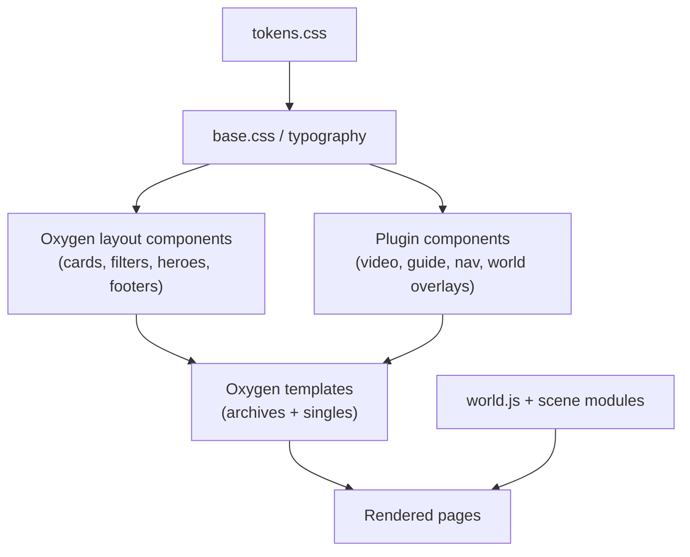

# Part 06 — Design System, Component Inventory, Video & Guide Component Systems

> Covers required output sections: **18. Design system**, **19. Component inventory**, **20. Video component system**, **21. Guide component system**
> Plan index: [README.md](README.md)

---

## Section 18 — Design System

Single source of truth: `cian-portfolio-core/assets/css/tokens.css` (CSS custom properties), enqueued site-wide before any builder CSS. Oxygen mirrors tokens as global colors/classes for editor convenience only.

### Color tokens

```css
:root {
  --bg-void: #040805;        /* main background */
  --surface-dark: #0B1010;   /* dark surface / panels */
  --surface-glass: rgb(11 16 16 / 0.72);  /* dark glass panels (backdrop-blur) */
  --purple-deep: #3A006F;    /* ambient light, large fields */
  --violet-electric: #7C3AED;/* primary accent, links, key lights */
  --silver-moon: #C8CDD8;    /* secondary text, rim light, borders */
  --white-soft: #F5F7FA;     /* primary text */
  --text-muted: #89919E;     /* muted text, metadata */
  --cyan-signal: #22D3EE;    /* ONLY: interactive/system indicators (focus, active, live) */
  --red-warning: #FF315B;    /* ONLY: warnings, errors, destructive */
}
```

Usage rules: purple/silver/black/soft-white form the identity; cyan and red never decorate — cyan marks *interactive/system state*, red marks *warnings*. Project accent colors come from a fixed token list (violet, silver, cyan-muted variants), not arbitrary hex. Contrast floors (verified): `--white-soft` on `--bg-void` ≈ 18:1; `--text-muted` on `--bg-void` ≈ 7.5:1; `--violet-electric` is **not** used for body text on dark (≈4.2:1) — link text uses a lightened variant `--violet-300: #A78BFA` (≈7:1) with violet reserved for large text/UI.

### Typography

- **Display/headings:** *Space Grotesk* (technical-futuristic yet highly readable; no hard-to-read display font). H1 clamp(2.2rem, 5vw, 3.5rem) → H4.
- **Body:** *Inter* — body `1.0625rem/1.7`, reading measure ~70ch.
- **Mono (commands/code/terminal UI):** *JetBrains Mono*, `0.95em`, with ligatures off in code blocks.
- All fonts **self-hosted** (woff2, `font-display: swap`, preloaded regular weights) — no Google Fonts CDN (GDPR, Part 11).
- Minimum UI text 0.875rem; no tiny interface text.

### Spacing, radius, elevation, layers

4 px base scale: `--space-1: 4px … --space-12: 96px`. Radii: panels 12 px, controls 8 px, chips 999 px. Elevation = 1 px silver-alpha border + soft violet glow shadow (`0 0 24px rgb(124 58 237 / 0.15)`) — glow is subtle, never bloom. Z-layers: canvas 0 → scene HTML overlays 10 → content panels 20 → command menu 30 → modals 40 → skip links/toasts 50.

### Motion rules

- Durations: micro 120–180 ms; panel 240 ms; camera transitions 900–1400 ms. Easing `cubic-bezier(0.22, 1, 0.36, 1)`.
- Ambient loops (particles, data lines, scan light) are slow (≥8 s cycles), low-contrast, and pause off-viewport/inactive tab.
- **`prefers-reduced-motion` + manual "Disable animation":** kills ambient loops, replaces camera transitions with crossfades, removes parallax. No flashing >3/s anywhere, ever (also a seizure-safety rule).
- Long articles/guides never have animated backgrounds.

### Iconography & imagery

Single stroke-style icon set (Lucide, self-hosted SVG sprite), 1.5 px stroke, silver default / cyan active. Imagery = real screenshots, real diagrams, rendered district vignettes — no stock cyberpunk city photos.

---

## Section 19 — Component Inventory

Legend: origin **OX** (Oxygen component), **BEO** (Breakdance Elements for Oxygen), **PLG** (plugin-rendered shortcode/JS).

| Component | Origin | Used on | Notes |
|---|---|---|---|
| Skip links | PLG | all | first focusable |
| Accessible system menu | OX + PLG (`navigation.js`) | all | Layer-3 nav |
| Radial command menu | PLG | all | DOM overlay, focus-trapped |
| Command/search palette (`Ctrl+K`) | PLG | all | merges menu + search |
| Footer (legal, social, sitemap link) | OX | all | quiet |
| Breadcrumbs | OX + SEO plugin data | singles | schema'd |
| Card: project / guide / article / video / review / series | OX | archives, related blocks | one card family, type variants |
| Filter bar (taxonomy + query params) | OX + PLG JS | archives | server-rendered results; JS enhances |
| Related-content block | PLG shortcode | all singles | reads relationship table |
| Tag/chip (technology, difficulty, status) | OX class | everywhere | |
| Score panel (overall ring + sub-score bars) | PLG | review single | data → UI + schema |
| Pros/cons columns | OX | review single | |
| Spec table | OX (ACF repeater loop) | review single | |
| Timeline | PLG shortcode | about | from `timeline_entry` |
| Contact form | Fluent Forms styled by tokens | contact | consent field |
| Lightbox gallery | BEO (or GLightbox if BEO's lacks a11y) | project/review | keyboard + focus tested |
| Accordion / tabs | BEO | guide FAQ, review detail | a11y-verified |
| Toast/notice (`aria-live`) | PLG | global | |
| Modal (accessible) | PLG | settings, consent | focus trap + restore |
| Hotspot (3D overlay button) | PLG | world | real `<button>` elements |
| Map overlay / `/map/` page | OX + PLG | global | |
| Settings panel (graphics/motion/sound) | PLG | world + a11y page | persists in `localStorage` |
| Video components | PLG | see §20 | |
| Guide components | PLG | see §21 | |



---

## Section 20 — Video Component System

All plugin-owned (`video.css`, `video-player.js`, `chapters.js`, `transcripts.js`), exposed as shortcodes/render callbacks that Oxygen templates place. One implementation reused everywhere (no duplicates).

1. **`VideoFacade`** — the only way a player appears. Renders cached local thumbnail + duration badge + accessible play button (`aria-label="Play: {title}"`). On activation: consent check (Part 11) → injects `youtube-nocookie.com` iframe (`title` attr set) or native `<video>` for local files (with `<track kind="captions">` from VTT). Keyboard/touch equivalent. Archives use `VideoCard` (no player at all).
2. **`VideoCard`** — static thumbnail, title, duration, category, date, difficulty, guide indicator (📄 "Written guide available" as icon + visually-hidden text), playlist/series indicator, YouTube badge, related project chip.
3. **`ChapterList`** — from chapters repeater: list of title + timestamp; click seeks (YouTube IFrame API `seekTo` once player consented/loaded; before load, click loads player then seeks). Renders three ways: sidebar list, inline clickable timestamps, horizontal timeline bar (desktop). Each chapter optionally links to its guide section anchor.
4. **`TranscriptPanel`** — collapsed by default ("Show transcript"); lazy-fetched via REST (`cian/v1/videos/{id}/transcript?page=n`), paginated for long videos; timestamped segments (click = seek); in-panel search highlighting; status badge (Automatic/Draft/Reviewed/Published — automatic shows an "unedited machine transcript" notice); semantic markup readable by screen readers; downloadable as .txt/.vtt.
5. **`CommandStrip`** — commands used in the video (shares `CommandBlock` with guides, §21).
6. **`DownloadList`** — files/source files with type + size.
7. **`CorrectionsBlock`** — timestamped corrections list, visually distinct (warning accent border).
8. **`SeriesRow` / `LessonList`** — ordered lessons with watch/read links + progress marker (localStorage).
9. **`SubscribePanel`** — YouTube channel link + subscribe CTA (plain link, no embedded subscribe widget — avoids third-party cookies).
10. **`FeaturedVideoHero`** — archive top slot; still a facade, never autoloaded.

---

## Section 21 — Guide Component System

Plugin-owned (`content.css` + small JS), consumed by the Oxygen guide template. Rendered from the `guide_steps` flexible-content field.

1. **`GuideHeader`** — title, summary, difficulty chip, estimated time, **last-verified date**, tested OS chips, tested software versions.
2. **`GuideMeta`** — prerequisites, required knowledge, required software/hardware lists.
3. **`GuideTOC`** — generated from step sections; sticky sidebar ≥1024 px, collapsible disclosure on mobile; scroll-spy highlights current section; always keyboard reachable.
4. **`StepSection`** — numbered H2 sections with body, screenshots (lazy, `alt` required), diagrams.
5. **`CommandBlock`** — mono block with language label and **Copy button** (Clipboard API, `aria-live` "Copied" feedback, visible fallback for no-JS: plain selectable text). Long commands wrap-safe with horizontal scroll container.
6. **`CodeBlock`** — syntax-highlighted (build-time/PHP-side highlighting via a lightweight highlighter — no heavy client JS), filename header, copy button.
7. **`InfoCallout` / `WarningCallout`** — violet-border info, red-border warning; icons + `role="note"`.
8. **`TroubleshootingList`** — problem/solution pairs as accordion (BEO accordion or native `<details>`).
9. **`ErrorIndex`** — common errors with exact error text in mono (search-indexed — supports "specific error message" queries).
10. **`VerificationChecklist`** — checkboxes (visual only, localStorage-persisted).
11. **`DownloadPanel`**, **`SourcesList`**.
12. **`GuideVideoPanel`** — embedded `VideoFacade` of the related video + `ChapterList` linking chapters ↔ guide sections both directions.
13. **`GuidePrevNext`** — series-aware previous/next.
14. **Action bar** — Watch on YouTube · Open video version · Download files · **Report outdated info** (prefilled contact form with guide URL) · Print (print stylesheet: light background, no chrome) · **Distraction-free mode** (hides everything but the article column; ESC exits; state announced).

**Reading-mode contract (enforced by template + `assets.php`):** on guide/article singles the 3D bundle is never enqueued; no pointer-parallax; native scrolling; ~70ch measure; TOC accessible; direct URL; full text selection and command copying. Background is flat `--bg-void` with at most a static subtle vignette — no animation behind long text.
