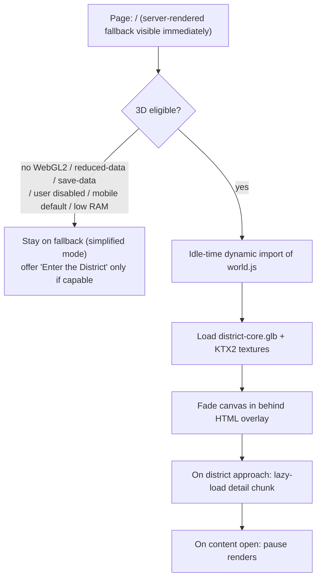

# Part 07 — Animation System & 3D Implementation Strategy

> Covers required output sections: **22. Animation system**, **23. 3D implementation strategy**
> Plan index: [README.md](README.md)

---

## Section 22 — Animation System

### Three animation tiers

| Tier | What | Technology | Runs when |
|---|---|---|---|
| 1 — UI micro-motion | hovers, focus glows, panel open/close, toasts | CSS transitions/keyframes only | everywhere; respects reduced motion |
| 2 — Environmental ambience | data lines, particles, fog drift, scan light, screen shimmer | Three.js shader/material animation inside the world scene; CSS equivalents in simplified/mobile mode | 3D mode only; density scales with graphics setting; fully off in reduced motion |
| 3 — Camera choreography | node-to-node transitions, arrival establishing move, focus push-ins | JS tween (small easing util, no GSAP dependency initially) driving the Three camera | 3D mode; replaced by instant cut + 240 ms crossfade under reduced motion |

### Rules (system-wide)

- Single `MotionController` module owns a global motion state: `full | simplified | none`, derived from `prefers-reduced-motion`, the user toggle (localStorage), and graphics tier. Every animated system subscribes; nothing animates without checking it.
- Render loop policy: **on-demand rendering** — the scene renders only during camera tweens, hotspot hover feedback, and while any Tier-2 loop is active *and* the tab is visible (`document.visibilityState`) *and* the canvas is in-viewport. Idle scene with ambience disabled = zero renders.
- Camera transitions: 900–1400 ms, eased, with interruption handling (a new target retargets the tween smoothly; no queuing walls). Reset camera returns to the current district node; Return to hub tweens to the establishing node.
- Loading behavior: no blocking full-screen loader. The fallback HTML renders immediately; the canvas fades in behind it when ready ("progressive reveal"). A small corner indicator shows scene loading state.
- Hover states: hotspot glow (cyan ring), label fade-in 150 ms; touch devices use tap-to-preview instead (first tap = label, second = navigate) with a visible "Open" affordance to avoid hidden interactions.
- Optional sound (Phase 9, opt-in only): UI ticks + low ambient bed, off by default, toggle in settings, never autoplays, `muted` state persisted.

---

## Section 23 — 3D Implementation Strategy

### Scope discipline

**One scene.** The Digital District is a single Three.js scene (~8 low-poly district structures + hub) with per-district *detail groups* loaded on approach. No per-district separate apps, no physics, no character controller, no post-processing stack beyond (High tier only) subtle bloom-free tonemapping + FXAA.

### Stack

- **Three.js** (pinned minor version) imported as ES modules, bundled by **Vite** into `world.[hash].js` (library build target), committed to the plugin's `assets/js/dist/`. Source in `assets/js/src/` with modules: `world.js` (bootstrap/scene), `camera.js` (node graph + tweens), `hotspots.js` (DOM-overlay sync), `navigation.js` (history/URL/menu bridge), `quality.js` (graphics tiers), `data.js` (REST fetch + cache).
- **Assets:** glTF 2.0 with **Draco/meshopt compression**, KTX2/Basis textures. Authored in Blender; exported per-district files: `district-core.glb` (hub + silhouettes, target ≤ 1.5 MB) and `district-{name}.glb` detail chunks (≤ 600 KB each), lazy-loaded on first approach and cached (Cache Storage API).
- **Text/UI:** never rendered in WebGL. All labels, panels, and hotspots are DOM overlays positioned via projected 3D coordinates (`Vector3.project`), updated on render frames only.

### Load & capability gating

Eligibility checks: WebGL2 context success, `navigator.deviceMemory` ≥ 4 (when available), `prefers-reduced-data`/Save-Data off, viewport ≥ 768 px (phones default to guided 2D mode with an explicit opt-in), no stored "simplified" preference. A 3-second frame-rate probe after load downgrades quality automatically if median FPS < 30.

### Graphics tiers

| Tier | Pixel ratio | Particles/data lines | Fog | Shadows | Detail chunks |
|---|---|---|---|---|---|
| Automatic | probe-driven | probe-driven | — | — | — |
| Low | min(dpr, 1) | off | static gradient | none | silhouettes only |
| Balanced | min(dpr, 1.5) | reduced | cheap exponential | none | on approach |
| High | min(dpr, 2) | full | animated volume | baked only | prefetched |

Adaptive pixel ratio also responds to sustained FPS drops (steps down one notch, announces nothing, logs to console).

### Data flow (world ↔ WordPress)

The world consumes one composed REST call: `GET /wp-json/cian/v1/world` → districts, featured project beacons (id, short title, summary, accent token, object id, URL), latest videos (thumb URLs for screen textures), latest guides, counts. Response is server-cached (transient, busted on relevant saves) and browser-cached (ETag). Clicking any world object ultimately resolves to a canonical URL — the world is a *navigator*, not a renderer of content.

### Fallback & failure behavior

- WebGL init failure at any point → silent removal of canvas, fallback remains (it was always rendered). No error walls.
- Asset chunk failure → district renders as silhouette; hotspot still works (it's DOM) and navigates to the URL.
- The **feature flag** (options page) can disable 3D globally in one click — the site is complete without it.

### Feature classification

| Feature | Value | Method | Owner | Maint. | Perf | A11y | Privacy | Verdict |
|---|---|---|---|---|---|---|---|---|
| Single hub scene w/ camera nodes | brand memorability | Three.js + node graph | PLG | Med | budgeted | fallback complete | none (self-hosted assets) | **Recommended** |
| DOM hotspots over canvas | robust interaction | overlay projection | PLG | Low | negligible | strongly positive | none | **Essential** (with 3D) |
| Lazy district detail chunks | perf | dynamic GLB | PLG | Med | positive | neutral | none | **Recommended** |
| Post-processing (bloom/DOF) | spectacle | — | — | High | negative | risk (glare) | none | **Rejected** (subtle tonemapping only) |
| Physics/character movement | — | — | — | — | — | negative | — | **Rejected** |
| WebXR/VR mode | novelty | — | — | High | — | — | — | **Rejected** for launch; future note |
