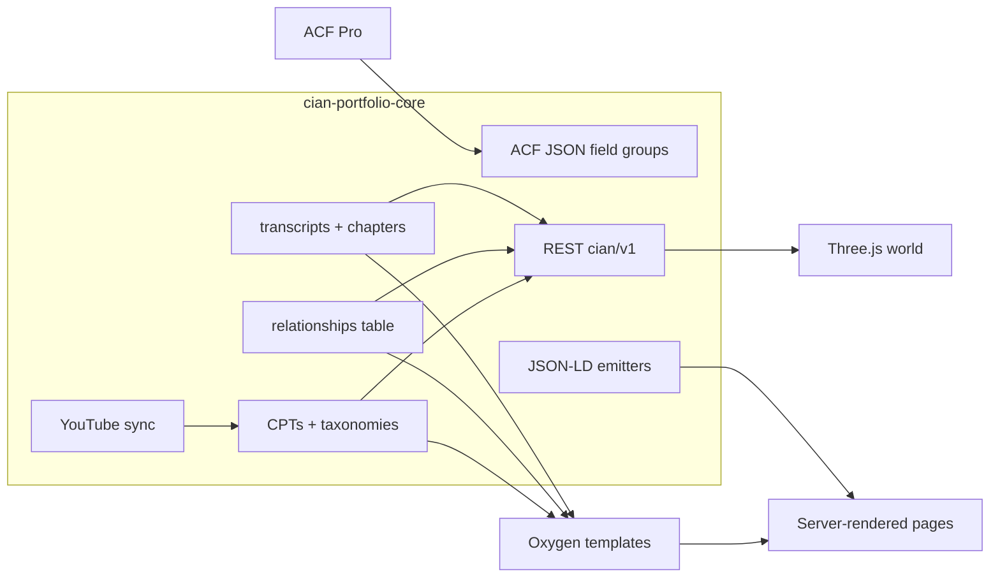
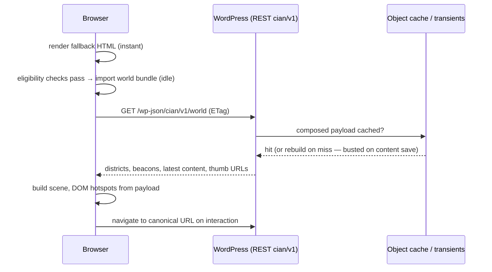
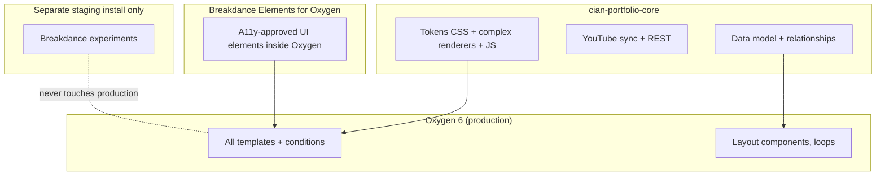
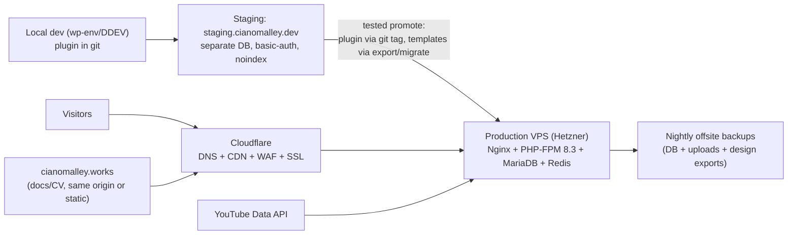

# Part 09 — Custom-Plugin Architecture, API & Data-Flow Diagrams, Search Architecture

> Covers required output sections: **26. Custom-plugin architecture**, **27. API and data-flow diagrams**, **28. Search architecture**
> Plan index: [README.md](README.md)

---

## Section 26 — Custom-Plugin Architecture: `cian-portfolio-core`

### Structure (as required by the brief, with build additions)

```text
cian-portfolio-core/
├── cian-portfolio-core.php        # bootstrap: constants, autoload, module registry
├── includes/
│   ├── post-types.php             # CPT registration (Part 03 §7)
│   ├── taxonomies.php             # taxonomy registration + initial terms migration
│   ├── acf-fields.php             # ACF JSON load point + field group registration
│   ├── relationships.php          # bidirectional sync + wp_cian_relationships table
│   ├── assets.php                 # conditional enqueueing (see policy below)
│   ├── rest-api.php               # cian/v1 endpoints
│   ├── youtube-api.php            # API client (ETag cache, backoff, quota log)
│   ├── youtube-sync.php           # sync orchestration (Part 04 §11)
│   ├── youtube-oauth.php          # optional OAuth (encrypted tokens)
│   ├── video-import.php           # channel/playlist import wizard
│   ├── transcripts.php            # transcript storage/parse (VTT/SRT/plain), status workflow
│   ├── chapters.php               # chapter parse (description → repeater), render helpers
│   ├── scheduled-tasks.php        # cron events + health checks
│   ├── admin-pages.php            # sync dashboard, attention queue, settings status page
│   ├── seo.php                    # JSON-LD emitters, video sitemap, SEO-plugin bridges
│   ├── security.php               # capability checks, nonces, sanitization helpers, upload rules
│   └── privacy.php                # consent gate, embed policy, exporter/eraser hooks
├── assets/
│   ├── css/  (tokens, base, components, content, video, accessibility)
│   ├── js/
│   │   ├── src/   (world, camera, hotspots, navigation, quality, data,
│   │   │           video-player, chapters, transcripts, accessibility, menu)
│   │   └── dist/  (vite build output, hashed)
│   └── models/    (glb + ktx2, git-lfs)
├── templates/                     # PHP partials for shortcode renderers
├── cli/
│   └── youtube-sync-command.php   # wp cian youtube …
├── acf-json/                      # versioned field groups
└── tests/                         # PHPUnit (sync diffing, transcript parse, REST)
```

### Module responsibilities & policies

- **Bootstrap:** requires PHP ≥ 8.1; each `includes/*.php` registers via a `Modules` registry so features are individually flag-disableable (e.g. `CIAN_DISABLE_WORLD`).
- **Conditional asset policy (`assets.php`):** `tokens/base/components` global; `content.css` on guide/article/reading templates; `video.css` + `video-player/chapters/transcripts.js` only where a video component renders; world bundle only on the front page *and* only via idle-time dynamic import after eligibility checks (Part 07); `accessibility.css/js` global. Nothing enqueues site-wide "just in case".
- **Transcripts storage:** custom table `wp_cian_transcript_segments (id, video_id, start_ms, end_ms, text, sort)` + per-video status/meta. Rationale: thousands of segments don't belong in `postmeta`; the table gives fast timestamp lookups, pagination, and clean search indexing. Import parsers for VTT/SRT/plain text; editor metabox with per-segment editing; full-text index on `text`.
- **Relationships table:** `wp_cian_relationships (from_id, to_id, rel_type, sort)` maintained from ACF saves (Part 03 §7) with unique key `(from_id, to_id, rel_type)`; powers reverse queries, related-content blocks, and the world endpoint without meta-query joins.
- **REST API (`cian/v1`):** `GET /world` (composed hub data, cached), `GET /videos/{id}/transcript?page=` , `GET /videos/{id}/chapters`, `GET /search?q=&type=` (bridges to search engine, §28), `POST /yt-webhook` (WebSub, HMAC-verified), `POST /report-outdated` (rate-limited, feeds contact inbox). All read endpoints public + cached; write endpoints nonce/capability-guarded.
- **Security module:** centralized sanitize/escape helpers, upload MIME allowlists (video/vtt/zip caps), rate limiting for public POSTs, admin capability `manage_cian_portfolio` mapped to admin role.
- **Privacy module:** consent state API (reads the CMP's signal), embed gate used by `VideoFacade`, WP personal-data exporter/eraser registration for form submissions.

---

## Section 27 — API and Data-Flow Diagrams

(Also see: YouTube sync diagrams in Part 04; site architecture + content ER in Part 03; builder component flow in Part 06.)

### WordPress content architecture



### Interactive-world data flow



### Builder ownership



### Deployment architecture



---

## Section 28 — Search Architecture

### Requirements recap

One global search across projects, guides, videos, articles, reviews, series, skills/technologies (taxonomies), **and transcripts**; categorized, fast, keyboard-first, deep-linkable, filterable; must match technical strings ("specific error messages", commands in transcripts).

### Evaluation

| Option | Custom fields | Transcripts (custom table) | Ops complexity | Cost | Verdict |
|---|---|---|---|---|---|
| Native WP search | no | no | none | free | **Rejected** — title/content only |
| **SearchWP** | yes (ACF native) | yes (custom-table indexing via its source/hook APIs) | low (stays in WP) | ~$99/yr | **Recommended** |
| Relevanssi | yes | partial (custom-content indexing via hooks, more glue code) | low | free/premium | **Fallback** if zero budget |
| Algolia | yes | yes | med-high (SaaS, EU data considerations) | usage | Deferred — overkill |
| Meilisearch / Typesense | yes | yes | high (run + secure a service) | server | Deferred — revisit at scale (Part 14 §44) |

**Recommendation: SearchWP** — the lowest-complexity engine that indexes ACF fields and, via a custom source, the `wp_cian_transcript_segments` table (segments indexed with their parent video ID; a matched segment returns the video URL with `?t=` timestamp deep link). Keyword stemming off for code-like tokens; partial-match enabled; per-engine weighting: title > summary/error-text > body > transcript.

### UX

- **Palette:** `Ctrl/Cmd+K` overlay (shared with command menu) — debounced queries to `cian/v1/search` (which proxies the engine), grouped results (Projects / Guides / Videos / Articles / Reviews / Series) with type icons, difficulty/date metadata, transcript matches labeled "in transcript @ 12:34". Full arrow-key navigation, `Enter` opens, result list `role="listbox"` semantics, announced counts.
- **No-JS/fallback:** standard `/search/?q=` results page (same engine, server-rendered, grouped with type filter links) — every palette state has a URL equivalent (deep-linkable).
- **Performance:** engine queries cached (short transient per normalized query); transcript index built incrementally on segment save; index rebuild is a WP-CLI command.
