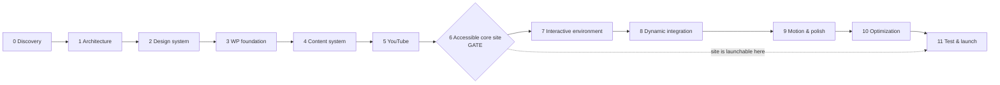

# Part 13 — Phased Roadmap & Testing Matrix

> Covers required output sections: **37. Phased roadmap**, **38. Testing matrix**
> Plan index: [README.md](README.md)

---

## Section 37 — Phased Roadmap

Each phase lists objectives, tasks, deliverables, dependencies, risks, acceptance criteria. Estimates assume one developer (Cian) part-time; phases 0–6 are strictly sequential; 7–9 can interleave with content production.

### Phase 0 — Discovery (≈1 week)

- **Objectives:** lock inputs so nothing downstream is invented.
- **Tasks:** review existing portfolio ideas/repo; confirm Oxygen 6 + BEO + ACF Pro licenses; confirm hosting choice & provision access; inventory real projects (which of the six are presentable now); confirm YouTube channel ID, existing videos, playlists; list first 10 guide topics; confirm CV file and social links; decide 3D ambition tier (full district vs hub-only first release).
- **Deliverables:** discovery doc (`docs/discovery.md`) with all confirmations; content inventory spreadsheet.
- **Dependencies:** none. **Risks:** scope optimism on 3D → mitigated by tiered ambition decision now.
- **Acceptance:** every "confirm" item answered in writing; no TBDs.

### Phase 1 — Architecture (≈1 week)

- **Objectives:** freeze technical decisions.
- **Tasks:** ratify Architecture A (or trigger the Phase-3 fallback rule); write builder-ownership doc; finalize CPT/taxonomy/field definitions (Part 03) against real content; define URL map + redirects; define YouTube integration scope (API-key sync now, WebSub optional, Workflow B deferred).
- **Deliverables:** `docs/decisions/` ADRs; final field spec.
- **Dependencies:** Phase 0. **Risks:** field-model churn later → mitigated by validating fields against 2 real projects/guides on paper.
- **Acceptance:** another developer could implement the model from docs alone.

### Phase 2 — Design System (≈1–2 weeks)

- **Objectives:** visual language locked before templates.
- **Tasks:** tokens.css; type scale + font subsetting; spacing/radius/elevation; component visual specs (cards, chips, panels, callouts, score panel); motion rules; video/guide component specs; accessibility rules (contrast checks, focus styles); district art direction boards (sketches/blockouts, not finals).
- **Deliverables:** tokens.css v1, component spec sheet (Figma or HTML styleguide page), art-direction doc.
- **Dependencies:** Phase 1. **Risks:** over-designing 3D before content system exists → cap art time at blockouts.
- **Acceptance:** styleguide page renders all components with tokens; contrast audit passes.

### Phase 3 — WordPress Foundation (≈1 week)

- **Objectives:** clean, secure, deployable base.
- **Tasks:** provision VPS + staging; clean WP install; Oxygen 6 + ACF Pro + security/2FA/backup/SEO plugins; `cian-portfolio-core` skeleton (bootstrap, post-types, taxonomies, acf-json loading, assets); git + deploy pipeline; backups running; **builder stability check → fallback decision point (Arch. B) executes here if needed**.
- **Deliverables:** staging + production environments; plugin v0.1; first restore test passed.
- **Dependencies:** Phases 1–2. **Risks:** Oxygen 6 instability → explicit fallback gate.
- **Acceptance:** deploy from git to staging works; backup restored once; CPTs visible in admin.

### Phase 4 — Core Content System (≈2–3 weeks)

- **Objectives:** all content types enterable and rendered.
- **Tasks:** full ACF groups; relationships module + custom table; Oxygen templates for all archives/singles (Part 08); guide/video/review plugin components (Parts 06); forms; search engine install + index config; seed real content (≥2 projects, ≥3 guides, ≥5 videos manually, ≥1 review, about, contact).
- **Deliverables:** every template rendering real content on staging.
- **Dependencies:** Phase 3. **Risks:** template sprawl → component-first discipline.
- **Acceptance:** owner can perform every §34 admin task without help; search returns categorized results.

### Phase 5 — YouTube Integration (≈1–2 weeks)

- **Objectives:** reliable sync with observability.
- **Tasks:** API client + credentials wiring; channel/playlist import wizard; sync diffing + locks; thumbnail caching; attention queue + dashboard; scheduled + manual + WP-CLI modes; error handling/backoff/quota logging; cached-metadata rendering audit; (optional) WebSub endpoint.
- **Deliverables:** dashboard green on real channel; full import of existing videos.
- **Dependencies:** Phase 4 (video CPT). **Risks:** API quirks (missing maxres thumbs, ISO durations) → fixture-based unit tests.
- **Acceptance:** all §38 sync tests pass on staging against the live channel.

### Phase 6 — Accessible Core Site (≈1 week, gate)

- **Objectives:** the complete non-3D site is finished and excellent **before any 3D work**.
- **Tasks:** accessible menu, skip links, focus management; reduced-motion audit; keyboard walkthroughs; screen-reader pass; legal pages (privacy, imprint, accessibility statement); SEO/schema emitters + sitemaps; mobile navigation (guided panels in 2D form); performance first pass.
- **Deliverables:** launch-capable standard website.
- **Dependencies:** Phases 4–5. **Risks:** none structural — this *is* the safety net.
- **Acceptance:** axe clean; keyboard-complete; CWV targets met on staging; **site could launch today without 3D**.

### Phase 7 — Interactive Environment (≈3–4 weeks)

- **Objectives:** the Digital District hub scene with all eight destinations.
- **Tasks:** Blender blockouts → compressed GLB pipeline; scene bootstrap + camera node graph; DOM hotspot layer; command menu integration; arrival platform, then district vignettes (project sector, knowledge archive, tutorial studio, review lab, identity chamber, communications relay, experimental sector); eligibility gating + graphics tiers; map overlay.
- **Deliverables:** navigable world on staging behind feature flag.
- **Dependencies:** Phase 6 gate passed. **Risks:** the plan's largest — scope/time overrun → hub-plus-silhouettes is the shippable minimum (tiered ambition from Phase 0); flag keeps production unaffected.
- **Acceptance:** all §38 environment tests pass; world adds ≤ agreed budgets; disable flag verified.

### Phase 8 — Dynamic Integration (≈1 week)

- **Objectives:** world driven by live content.
- **Tasks:** `cian/v1/world` endpoint + caching; project beacons, video screens (cached thumbs), guide shelves, review exhibits bound to data; search/command palette wired inside world; URL/history integration hardened.
- **Deliverables:** content changes reflect in world without code edits.
- **Dependencies:** Phase 7. **Risks:** cache staleness → purge hooks tested.
- **Acceptance:** publishing a featured project adds its beacon (after cache purge) with correct label/link.

### Phase 9 — Motion & Polish (≈1 week)

- **Objectives:** choreography and feel.
- **Tasks:** camera transition tuning; hover/focus feedback; ambient loops per graphics tier; loading/reveal behavior; optional opt-in sound; settings panel final; reduced-motion parity re-verified.
- **Deliverables:** polished experience matching Part 07 rules.
- **Dependencies:** Phase 8. **Acceptance:** motion review checklist signed; no interaction requires hover or animation.

### Phase 10 — Optimization (≈1 week)

- **Objectives:** meet every budget in Part 10 §31.
- **Tasks:** asset compression passes (draco/ktx2/webp/avif/font subset); conditional-loading audit; embed/transcript loading verification; page/object cache config; CWV field+lab measurement; DB index verification.
- **Deliverables:** budget report (measured vs target, committed to repo).
- **Acceptance:** all budgets green on staging under mobile throttling.

### Phase 11 — Testing & Launch (≈1 week)

- **Objectives:** verified production go-live.
- **Tasks:** full §38 matrix execution; cross-device pass; SEO/schema validation; security review (headers, uploads, rate limits, 2FA); backup + restore validation; DNS cutover (`cianomalley.dev` live, `.works` docs surface); post-launch monitoring week (uptime, sync cron, 404s, CWV field data).
- **Deliverables:** launch; test report; post-launch checklist (Part 14 §43).
- **Acceptance:** production green on the full matrix; rollback plan documented and tested (restore from backup).

---

## Section 38 — Testing Matrix

Environment axes: browsers (Chrome, Firefox, Safari incl. iOS, Edge) × devices (desktop, laptop, iPad-class, mid Android, older Android) × modes (3D on/off, reduced motion, no-JS where applicable) × network (broadband, throttled 4G).

### Video synchronization

| Test | Method | Pass criterion |
|---|---|---|
| Initial channel connection | fresh install, add key, connect | channel shown; uploads playlist resolved |
| OAuth renewal (if enabled) | expire token artificially | silent refresh; failure surfaces in dashboard |
| Manual sync | dashboard button | run log written; counts correct |
| Scheduled sync | cron fire (real cron) | same result as manual; staleness warning clears |
| Playlist import | select 2 playlists | terms created with `yt_playlist_id`; videos assigned |
| New video detection | publish test video (unlisted→public) | post auto-created with metadata + local thumbnail |
| Updated title/thumbnail detection | edit in Studio, resync | WP updated unless field locked; lock respected |
| Deleted video handling | delete test video | status `deleted-on-youtube`; page shows notice; post retained |
| Private video handling | flip to private | flagged; frontend hides player, keeps transcript/guide |
| API quota failure | mock 403 quotaExceeded | graceful abort, error logged, retry scheduled |
| Temporary API failure | mock 500/timeout | 3 backoff retries, partial-run integrity |
| Duplicate prevention | re-import same playlist | zero duplicate posts (unique ID check) |

### Video playback

YouTube player (nocookie) loads on click only · facade shows before consent, zero Google requests pre-click (verified in devtools network) · local `<video>` with captions track + range requests · captions render (YT + local) · transcript loads lazily, paginates, seeks on click · chapters seek correctly incl. pre-load click · mobile playback (iOS inline) · full keyboard control of facade + panels.

### Content relationships

video→guide and reverse mirror on save · project→series both directions · review↔video · playlist term↔series suggestion · related-content blocks render correct items and no orphans after deleting one side (cleanup hook).

### Functional

all four navigation layers reach all sections · search: categorized results, transcript hit deep-links with timestamp, no-JS `/search/` works · archive filters (each taxonomy + combinations + empty-result state) · contact form (validation, consent required, honeypot, success/failure announcements, submission stored + mail delivered) · deep links to every template render server-side · CV downloads from Relay + About · external links (GitHub etc.) valid.

### Interactive environment

every camera node reachable and framed correctly at all breakpoints · every hotspot: hover label, focus label, click/enter/tap navigates · reset camera + return to hub from every node · no trapped states (spam-click transitions, browser back mid-tween, Esc during tween) · no clipping/z-fighting at any node · feature flag off = zero world assets requested · WebGL-unavailable browser gets fallback silently.

### Accessibility

keyboard-only full journey (recruiter journey A completed without mouse) · NVDA/Firefox + VoiceOver/Safari walkthroughs (landmarks, headings, live announcements) · reduced-motion: no ambient motion, crossfade transitions · captions + transcript present on all tutorial videos · forms: labels, error association, error summary · contrast audit on final tokens · focus visible everywhere, restored after modals/menus.

### Performance

initial load (cold, 4G, mid-device): CWV targets (Part 10) · repeat load (warm cache) · mobile-data mode: no 3D, images lazy · low-performance device: auto-downgrade to Low observed · YouTube facade adds no third-party bytes pre-click · transcript fetch ≤ 30 KB/page · Three.js: 60 fps High/desktop, ≥30 fps Balanced/laptop, idle = 0 renders (perf panel) · memory: no unbounded growth navigating all districts 10× (heap snapshot delta < 10 MB).
